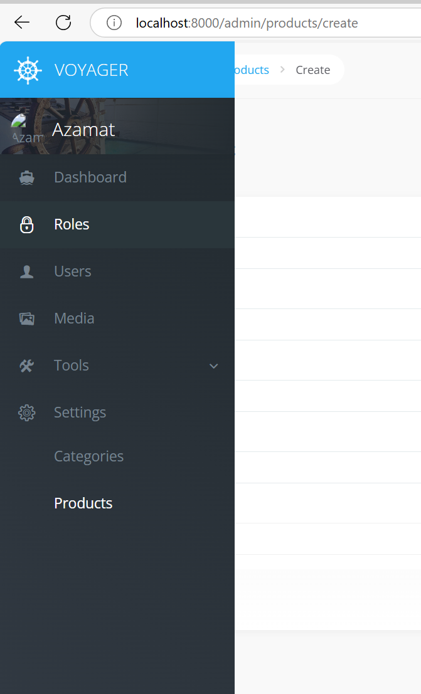
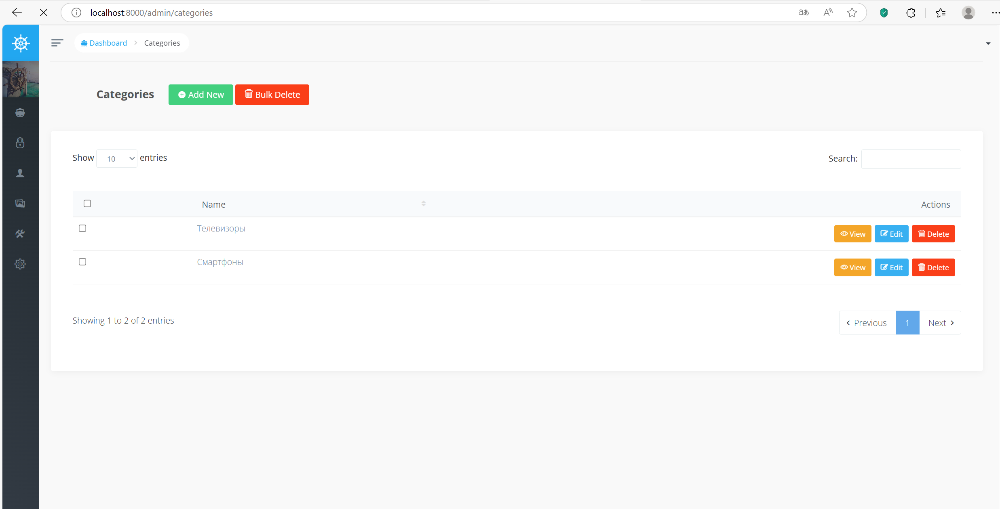
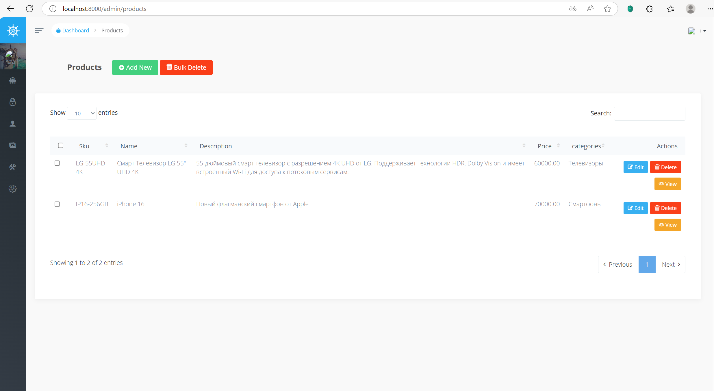
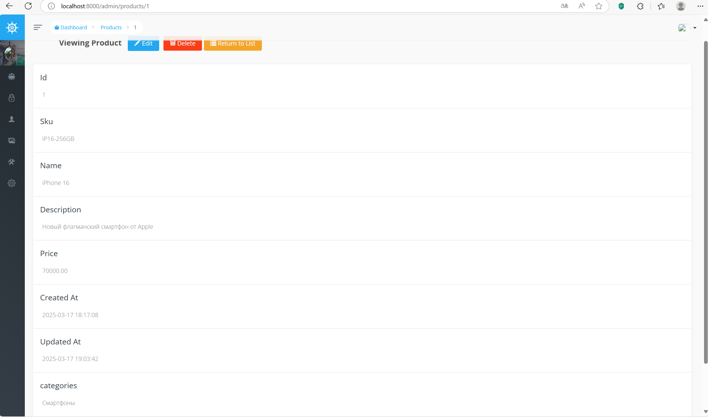
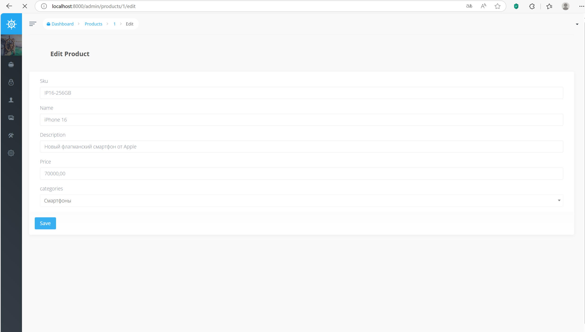
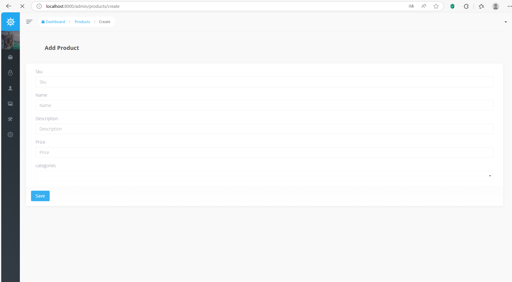
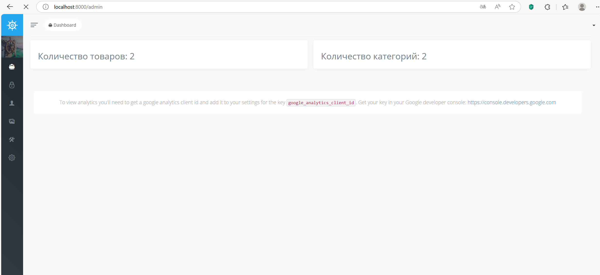

# 🛠️ Админ-панель интернет-магазина на Laravel с Voyager

Проект представляет собой админ-панель для управления складом интернет-магазина. Панель реализована с использованием Laravel и Voyager и предоставляет CRUD-интерфейс для категорий и товаров.

Создан в рамках практической работы GeekBrains по теме: **Интеграция админ-панели и настройка CRUD в Voyager**.

---

## 🎯 Цели проекта

- Интеграция админ-панели Voyager в Laravel-приложение
- Реализация CRUD-интерфейса для категорий и товаров
- Настройка связи "один ко многим" между категориями и товарами
- Создание пользовательских виджетов для отображения статистики

---

## 🧩 Стек технологий

- **Laravel 8** – PHP-фреймворк
- **Voyager** (`tcg/voyager`) – админ-панель
- **MySQL** – база данных
- **Laravel Migrations** – создание таблиц
- **Blade (опционально)** – если потребуется ручная настройка интерфейсов
- **PHP Artisan** – генерация кода и миграций

---

## ⚙️ Установка и настройка

### 1. Клонировать репозиторий

```bash
git clone https://github.com/AzaS31/Laravel-admin-panel.git
cd Laravel-admin-panel
```

### 2. Установить зависимости

```bash
composer install
```

### 3. Настроить файл `.env`

```bash
cp .env.example .env
```

Указать в `.env` данные подключения к базе.

### 4. Сгенерировать ключ приложения

```bash
php artisan key:generate
```

### 5. Создать модели и миграции

```bash
php artisan make:model Category -m
php artisan make:model Product -m
```

В миграциях:

```php
// categories
$table->id();
$table->string('name');
$table->timestamps();

// products
$table->id();
$table->string('sku');
$table->string('name');
$table->foreignId('category_id')->constrained();
$table->timestamps();
```

### 6. Выполнить миграции

```bash
php artisan migrate
```

### 7. Установить Voyager

```bash
composer require tcg/voyager
php artisan voyager:install
```

### 8. Создать администратора

```bash
php artisan voyager:admin your@email.com
```

---

## 🔐 Доступ к админ-панели

Перейдите в браузере по адресу:

```
http://localhost:8000/admin
```

Войдите, используя email и пароль администратора, созданного на шаге 7.

---

## 📋 Настройка CRUD в Voyager

1. Перейти в `/admin`
2. Зайти в **Tools > BREAD**
3. Добавить BREAD для `categories` и `products`
4. В `products` нажать **Create Relationship**
   - **Display Name**: Category
   - **Model**: `App\Models\Category`
   - **Relationship Type**: `belongsTo`
   - **Column**: `category_id`
   - Сохранить

---

## 📊 Виджеты

Создать директорию:

```
app/Admin/Widgets
```

Добавить:

- `ProductsWidget.php` — считает количество товаров
- `CategoriesWidget.php` — считает количество категорий

В `config/voyager.php` добавить:

```php
'widgets' => [
    App\Admin\Widgets\ProductsWidget::class,
    App\Admin\Widgets\CategoriesWidget::class,
],
```

Теперь на главной странице админки отображается статистика.

---

## ✅ Проверка

- В админке создать категорию
- Создать товар, привязав его к категории
- Убедиться, что виджеты отображают правильные числа

---

## 📂 Структура проекта

| Компонент                         | Описание                                       |
|----------------------------------|------------------------------------------------|
| `Category`                       | Модель категории (id, name, timestamps)        |
| `Product`                        | Модель товара (sku, name, category_id)         |
| `App\Admin\Widgets`            | Каталог виджетов Voyager                      |
| `routes/web.php`                 | Laravel-маршруты (не изменялись вручную)       |
| `resources/views/vendor/voyager`| (если были кастомизации интерфейса)           |

---

## 🧑‍💻 Автор

**Azamat S.**  
[GitHub: @AzaS31](https://github.com/AzaS31)

---

## 📜 Лицензия

Проект предоставляется под лицензией MIT.

---

## Скриншоты







